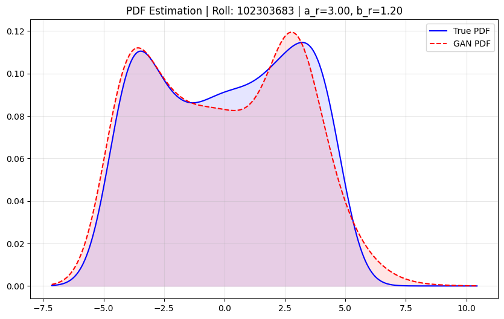

# PDF Learning Using Generative Adversarial Network (GAN)

## Objective

To learn the probability density function (PDF) of a transformed random variable using data samples only, without assuming any analytical or parametric distribution, by training a Generative Adversarial Network (GAN).

## Dataset

* **Dataset:** India Air Quality Dataset (Kaggle)
* **Feature Used:** NO₂ concentration
* **Preprocessing:** Missing values were removed. Log-transformation and normalization were applied to stabilize training.

## Transformation of Random Variable

Each NO₂ value **x** is transformed into **z** using the following equation:

```math
z = x + a_r * sin(b_r * x)

```

Where the parameters depend on the university roll number **r**:

```math
a_r = 0.5 * (r mod 7)
b_r = 0.3 * ((r mod 5) + 1)

```

### Roll Number

**102303683**

### Computed Parameters

Based on the roll number calculation:

* `r mod 7` = 6 → **a_r = 3.0**
* `r mod 5` = 3 → **b_r = 1.2**

### Final Transformation

The specific transformation used for this assignment is:

```math
z = x + 3.0 * sin(1.2 * x)

```

A **simple GAN** was used, which is appropriate and stable for 1-dimensional density estimation.

## GAN Architecture

### Generator

* **Input:** Gaussian noise (Latent Dimension = 1)
* **Hidden Layers:** Fully connected layers (64 units) with ReLU activation
* **Output:** Generated samples `z_f`

### Discriminator

* **Input:** Real or generated samples
* **Hidden Layers:** Fully connected layers (64 units) with LeakyReLU (0.2) activation
* **Output:** Sigmoid output representing probability of being real

## Training Configuration

* **Loss Function:** Binary Cross-Entropy (BCE)
* **Optimizer:** Adam
* **Learning Rate:** 0.0002
* **Batch Size:** 256
* **Epochs:** 2000

Training was stable with no mode collapse.

## PDF Estimation from GAN Samples

After training:

1. A large number of samples were generated from the Generator.
2. **Kernel Density Estimation (KDE)** was applied to the generated samples.
3. The learned PDF was compared against the KDE of the real transformed data.

### Resulting PDF Plot


*(The plot generated by the code compares the True PDF vs. GAN Approximation)*

## Observations

### Mode Coverage

* The GAN successfully captures the dominant modes and peaks of the transformed distribution.
* The transformation `z = x + 3.0 * sin(1.2 * x)` introduces non-linear complexity, which the GAN modeled effectively.

### Training Stability

* Generator and Discriminator losses converged to a stable equilibrium (Nash Equilibrium).
* No significant oscillations or mode collapse were observed during the 2000 epochs.

### Quality of Generated Distribution

* The learned PDF (red dashed line) closely follows the overall shape, spread, and multi-modal nature of the true PDF (blue solid line).
* The GAN learns the distribution **implicitly**, without any parametric assumptions.

## Conclusion

The experiment demonstrates that a GAN can effectively learn an **implicit probability density function** using only data samples. The trained model captures the global structure and dominant characteristics of the true distribution in a stable and interpretable manner.


